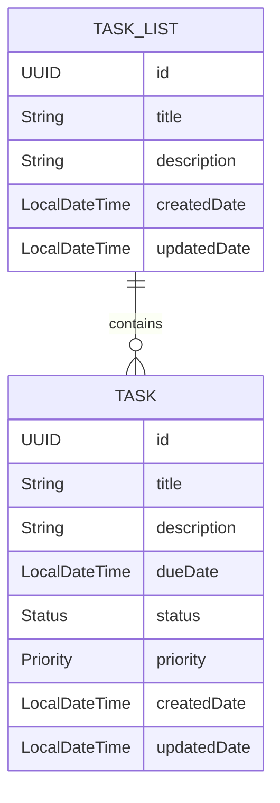

# TODO APP

## Domain Overview

### TASK_LIST
Contains multiple tasks.

- **title**: The title of the task list.
- **description**: A brief description of the task list.
- **task_list**: A list of tasks.

### TASK
Represents an individual task.

- **title**: The title of the task.
- **description**: A brief description of the task.
- **dueDate**: The date by which the task needs to be completed. This should be in the format `YYYY-MM-DD`.
- **status**: The current status of the task. Possible values are:
    - `OPEN`
    - `CLOSED`
- **priority**: The priority level of the task. Possible values are:
    - `HIGH`
    - `MEDIUM`
    - `LOW`
## ERD


## Class
```java
public class TaskList {
    private UUID id;
    private String title;
    private String description;
    private List<Task> taskList;
    private LocalDateTime createdDate;
    private LocalDateTime updatedDate;

    // Getters and Setters
}

public class Task {
    private UUID id;
    private String title;
    private String description;
    private LocalDateTime dueDate;
    private Status status;
    private Priority priority;
    private List<Task> taskList;
    private LocalDateTime createdDate;
    private LocalDateTime updatedDate;

    // Getters and Setters
}

public enum Status {
    OPEN,
    CLOSED
}

public enum Priority {
    HIGH,
    MEDIUM,
    LOW
}
```
## Spring JPA Entities

```java
import javax.persistence.*;
import java.time.LocalDateTime;
import java.util.List;
import java.util.UUID;

@Entity
public class TaskList {
    @Id
    @GeneratedValue(strategy = GenerationType.AUTO)
    private UUID id;
    private String title;
    private String description;
    @OneToMany(mappedBy = "taskList", cascade = CascadeType.ALL, orphanRemoval = true)
    private List<Task> taskList;
    private LocalDateTime createdDate;
    private LocalDateTime updatedDate;

    // Getters and Setters
}

@Entity
public class Task {
    @Id
    @GeneratedValue(strategy = GenerationType.AUTO)
    private UUID id;
    private String title;
    private String description;
    private LocalDateTime dueDate;
    @Enumerated(EnumType.STRING)
    private Status status;
    @Enumerated(EnumType.STRING)
    private Priority priority;
    @ManyToOne
    @JoinColumn(name = "task_list_id")
    private TaskList taskList;
    private LocalDateTime createdDate;
    private LocalDateTime updatedDate;

    // Getters and Setters
}

public enum Status {
    OPEN,
    CLOSED
}

public enum Priority {
    HIGH,
    MEDIUM,
    LOW
}
```
## Task Lists API

### Task Lists

| Method | Endpoint                        | Description          |
|--------|---------------------------------|----------------------|
| GET    | `/task-lists`                   | List Task Lists      |
| POST   | `/task-lists`                   | Create Task List     |
| GET    | `/task-lists/{task_list_id}`    | Get Task List by ID  |
| PUT    | `/task-lists/{task_list_id}`    | Update Task List     |
| DELETE | `/task-lists/{task_list_id}`    | Delete Task List     |

### Tasks

| Method | Endpoint                                    | Description          |
|--------|--------------------------------------------|----------------------|
| GET    | `/task-lists/{task_list_id}/tasks`         | List Tasks           |
| POST   | `/task-lists/{task_list_id}/tasks`         | Create Task          |
| GET    | `/task-lists/{task_list_id}/tasks/{task_id}` | Get Task by ID       |
| PUT    | `/task-lists/{task_list_id}/tasks/{task_id}` | Update Task          |
| DELETE | `/task-lists/{task_list_id}/tasks/{task_id}` | Delete Task          |
